# Chapter 2: VSCode - Your One-Stop Development Shop

Welcome to Chapter 2! In this chapter you will learn how to use VSCode at a high level. Please note: VSCode is quite expansive; thus, we will only go over the content needed for this workshop. I would highly encourage you to read the [documentation](https://code.visualstudio.com/Docs) to learn about all of its features and customizations.

## Window Overview

When loading into a fresh VSCode window, you should be greeted wth a window that looks something like the following. We will first look into several of the main buttons you may be interested in.

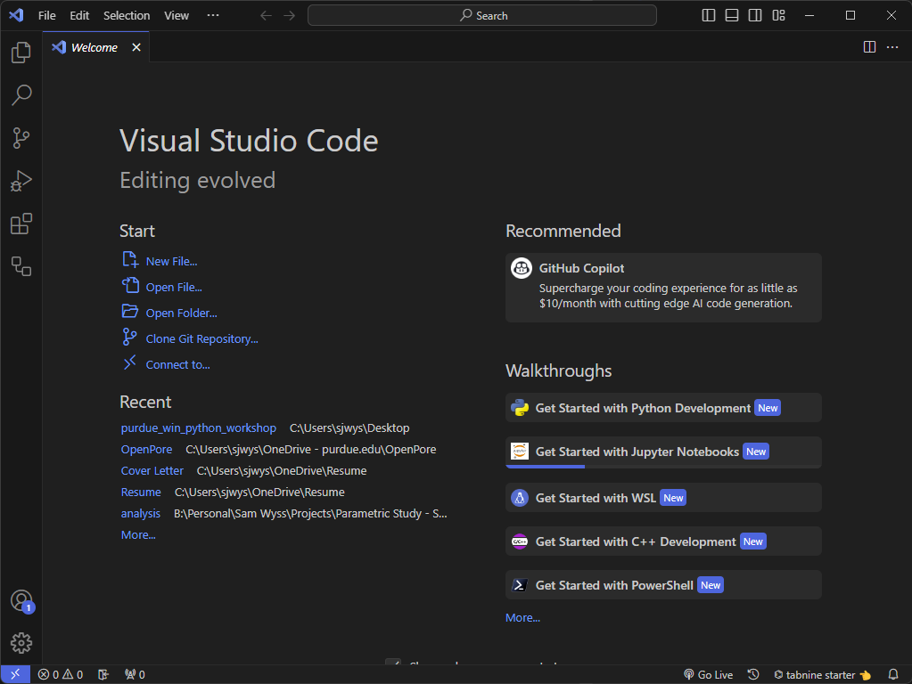

### Activity Bar

On the left, you will see the _Activity Bar_. We will now go highlight several of the useful actions here.

#### Explorer

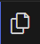

This allows you to view files within the root directory VSCode is operating out of. When working out of this workshop, your file explorer should look something like the following.

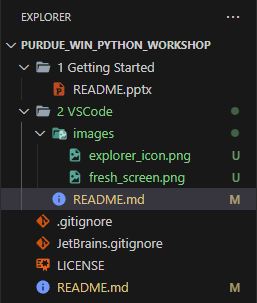

You can open a file in the explorer simply by double clicking it. Files will then appear in the workspace as shown.

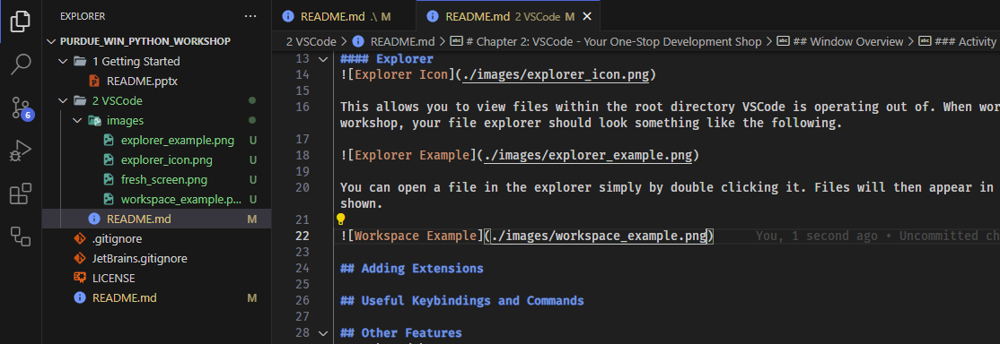

A useful command to clear your workspace is:

    Ctrl+K -> F

This and several other useful commands can be found in the _Useful Keybindings and Commands_ Section of this file.

#### Search

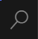

This allows you to easily search (and replace) for files or text in files as shown below when searching for the word `search`.

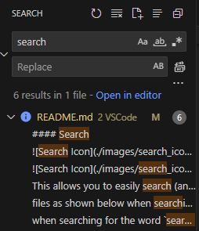

You can also search for text in a single file or for a file explicitly by using the command

    Ctrl+F

while a file is selected in the workspace or while the file explorer is opened respectively.

#### Debugger

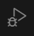

This button will open the debugger menu. When used this will attach a debugger that will allow us to look inside the Python interpreter while a Python script is running. We will explore this in the future once we begin running Python scripts.

#### Extensions

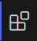

This button allows you to add and manage extensions. Extensions provide you the ability to add functionality into VSCode to suit your needs (from working with a specific language/framework to directly integrating with your Spotify account, the possibilities are endless).

When you open the Extensions menu you will be greeted with a list of all currently installed extensions and can search for additional extensions by typing into the `Search Extensions in the Marketplace` menu. We will install several extensions for Python in the next section.

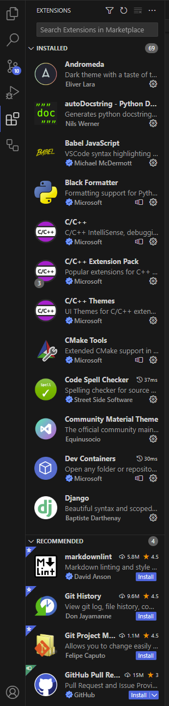

#### Command Center

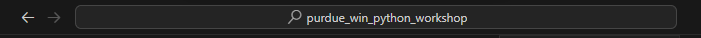

Clicking on this button will open the Command Center. From here you will be able to see all the commands at your disposal. We will use several of these over the course of the workshop.

The Command Center (or Command Pallette) can quickly be opened by using the following keybinding.

    Ctrl+Shift+P

#### Layout Controls

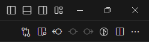

This cluster of buttons allows you to change the layout of your VSCode tab. Of these the most important for this workshop are the `Open Preview to the Side` (for markdown files (which you should be using now)) and `Split Editor Right` which allows you to view and edit multiple files at the same time. You can drag files between split editors by dragging and dropping them.

## Adding Extensions

## Useful Keybindings and Commands

## Next Chapter
