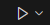

# Hello World - Your First Python Program

Welcome to Chapter 3! This chapter is rather short but useful for those of you who are just starting out. We will start by making a `hello_world`

## Creating New Python Files in VSCode

To begin, we need to create a new python file called `hello_world.py`. To do this, open the explorer and right click. You should see the option _New File_, click it and then type

    hello_world.py

into the box.

The `.py` file extension lets your operating system know that this file is associated with the Python interpreter. We will talk more about the Python interpreter shortly.

## Hello World Program

Go ahead and open the empty Python file. In Python, writing a program that prints _Hello World!_ to a terminal can be accomplished using the `print` function as shown below. We will talk more about functions in Ch. 7.

Go ahead and type the following into your `hello_world.py` file (don't get in the habit of just copy/pasting)

`hello_world.py`

    print("Hello World!")

When run with VSCode (the next section), this function will print any string to _standard out_ which in this case is a terminal window managed by VSCode. We will now learn how to run this program and other python files in general.

## Running Python Files

### Using VSCode

In this workshop, we we will be using VSCode to run all programs we write. This can be accomplished by navigating to the top right of your screen (when viewing your Python file) and clicking the following button.

After this you should see a new terminal window appear at the bottom of the screen and then "Hello World!" printed on a new line.

### Using a Terminal

While not used in this workshop, you can also run Python files directly from a terminal window. **As you go on you will likely learn why this method is far better than running programs directly inside VSCode windows.** But for simplicity, we will stick to using VSCode to run our programs. You can run Python files from a terminal window using the commands below depending on your operating system assuming Python installed correctly.

#### Windows

    python .\relative\path\to\your\python\file.py

#### Unix/Linux

    python3 ./relative/path/to/your/python/file.py

## What Happens When You Ran hello_world.py?

At a very high level, here is what happened when you ran `hello_world.py`:

1. VSCode automatically opened a terminal and pasted the absolute path to your Python interpreter and the absolute path to your Python file (if you read the above section regarding running python from a terminal, this should look very familiar).
2. Recognizing that your file ends in `.py`, the Python interpreter opened your file and began trying to understand what you want it to do.
3. Once it found the call to the `print` function with the string `"Hello World!"` as an argument it then ran the print function which is defined in the [Python Standard Library](https://docs.python.org/3/library/index.html) thus there is no need for you to implement a print function.
4. The print function will in essence dump its argument to standard out, thereby displauing it on your VSCode terminal window.

When writing your own Python functions, **it is often useful to think your code as a means to interact with the Python interpreter which will then do things on your behalf**. For base Python it is often not that useful to use lower level programming models (considering things like stack vs. heap memory allocation, CPU caching / cache hierarchies, or individual CPU instructions) as the Python interpreter abstracts much of this away even though all of these lower level features are still happening under the hood.

## Exercise 3.1

_Create a new Python program that greets you on one line, prints your major on a separate line, and finally displays your graduation year on another line_

**Note:** When running your program, notice how every print statements prints to a new line. This tells you that the print function automatically inserts a newline character, `\n`, at the end of your string.
